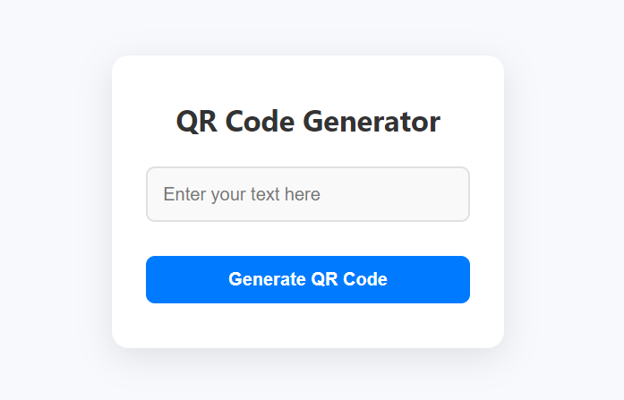

# QR Code Generator Project

This project is a simple **QR Code Generator** built with **JavaScript**, **HTML**, and **CSS**. It allows users to input text and generate a corresponding QR code dynamically. After generating the QR code, users can clear the generated code and try again.

## Table of Contents
- [Screenshot](#screenshot)
- [Features](#features)
- [Built With](#built-with)
- [Prerequisites](#prerequisites)
- [Usage](#usage)
- [Contact](#contact)

## Screenshot




<p align="right">(<a href="#table-of-contents">back to top</a>)</p>

## Features

- Clean and user-friendly interface.
- Input any text to generate a QR code.
- QR code generation happens instantly after clicking the "Generate" button.
- Hide the input field and button after generating the QR code to avoid clutter.
- Option to reset and generate another QR code with a "Try Again" button.
- Responsive design that adjusts to different screen sizes.

<p align="right">(<a href="#table-of-contents">back to top</a>)</p>

## Built With

This project was built using the following technologies:

* 
* 
* 

<p align="right">(<a href="#table-of-contents">back to top</a>)</p>

## Prerequisites

To run this project, all you need is a modern web browser that supports HTML, CSS, and JavaScript. Additionally, it uses the **QRCode.js** library to generate the QR codes, which is included via a CDN.

<p align="right">(<a href="#table-of-contents">back to top</a>)</p>

## Usage

1. Clone the project from GitHub or download the files:
   ```bash
   git clone https://github.com/AmirrezaAhmadi/QrCode-Generator-App.git

2. Open the QrCodeGenerator App.Html file in your browser.

3. Enter any text in the input box and click "Generate QR Code" to see the QR code.

4. Click "Try Again" to reset the form and generate a new QR code.

<p align="right">(<a href="#table-of-contents">back to top</a>)</p>

## Contact

You can reach me through the following:

* Email: AmirrezaAhmadi.GH@Gmail.com
* Telegram: https://t.me/AmirrezaDevelop
* Instagram: https://www.instagram.com/codewithamirreza
* Project Link: https://github.com/AmirrezaAhmadi/QrCode-Generator-App.git

<p align="right">(<a href="#table-of-contents">back to top</a>)</p>